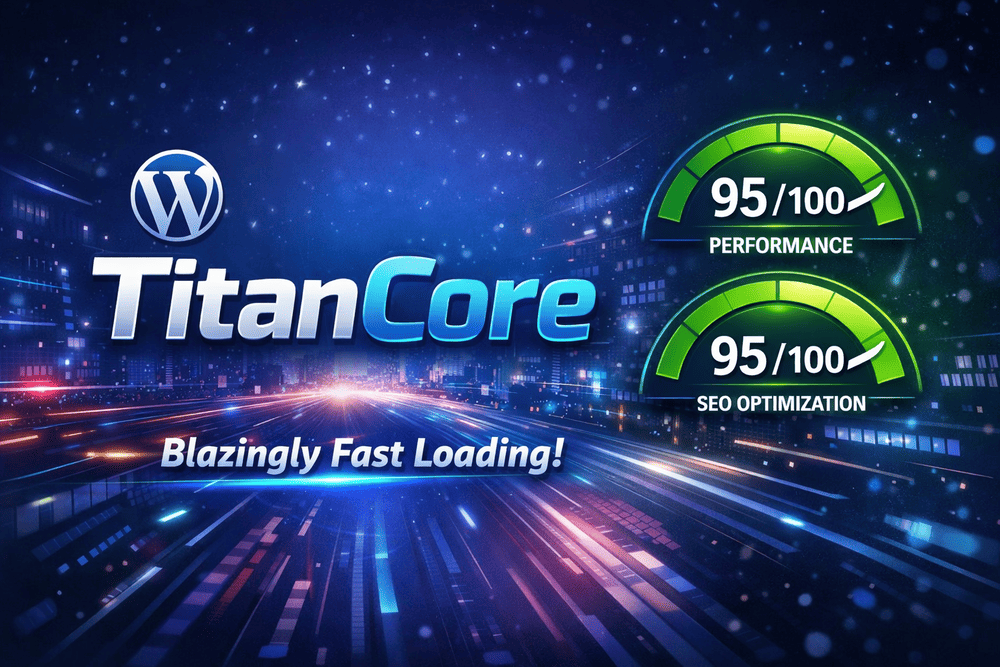

# TitanCore WordPress Theme

Ultra-fast, clean-coded WordPress theme for blogs and magazines. Dark mode, three front-page presets, built-in SEO, and zero bloat.



---

## Why TitanCore

Most WordPress themes ship megabytes of CSS frameworks, icon fonts, jQuery plugins, and page-builder overhead. TitanCore ships **none of that**. Every line is hand-written, every asset is justified, and the result is a theme that loads near-instantly for readers while staying dead-simple to manage.

No AI-generated slop. No bloated dependencies. Just clean PHP, minimal CSS, and vanilla JavaScript.

---

## Features

### Performance
- Zero jQuery on the frontend (stays registered for plugin compat)
- No Font Awesome — inline SVG icons only (Lucide, ISC License)
- WordPress emoji scripts removed (~15 KB saved per page)
- Block library CSS loaded only when blocks are present
- Navigation JS deferred with `strategy: defer`
- Proper `fetchpriority`, `loading`, and `sizes` attributes on every image
- Locally hosted Inter variable font with optional preload
- Separate core block asset loading enabled
- Font Awesome auto-blocked from plugin injection

### Dark Mode
- System-preference aware (respects `prefers-color-scheme`)
- Manual toggle with localStorage persistence
- Force light-only or dark-only via Customizer
- Full colour palette configurable per mode

### Front-Page Presets
Switch between three layouts with one Customizer dropdown:
- **Modern Blog** — responsive card grid
- **News Portal** — hero article + trending sidebar + grid
- **Magazine** — featured duo + article list

### Built-in SEO
When no dedicated SEO plugin is detected (Yoast, Rank Math, SEOPress, AIOSEO):
- Meta description fallbacks for all page types
- Open Graph + Twitter Card meta tags
- Canonical URLs with `rel="prev"` / `rel="next"` pagination
- JSON-LD: `WebSite` + `SearchAction`, `Organization`, `Article`, `BreadcrumbList`
- `noindex` on search results and 404 pages

All SEO output automatically suppressed when a dedicated plugin is active.

### Accessibility
- Skip-to-content link
- Full keyboard navigation with focus management
- ARIA attributes on mobile menu, toggles, and navigation
- `prefers-reduced-motion` support (animations disabled)
- Semantic HTML5 throughout

### Customizer Options
- **Header**: sticky toggle, logo vs text title, custom header code
- **Colours**: primary, accent, light/dark background and foreground, grid pattern colour and opacity
- **Front Page**: layout preset, tag limit, post limit
- **Single Post**: Table of Contents toggle
- **Footer**: custom footer code with safe-mode filtering
- **Footer Widgets**: optional block/widget area above the footer credits

---

## Installation

### From WordPress Admin
1. Go to **Appearance → Themes → Add New → Upload Theme**
2. Upload the `.zip` file and click **Install Now**
3. Click **Activate**

### Manual
1. Extract the theme folder to `wp-content/themes/titancore/`
2. Activate from **Appearance → Themes**

### After Activation
- Set up menus at **Appearance → Menus** (Primary, Secondary, Footer)
- Configure the theme at **Appearance → Customize**
- Under **Settings → Reading**, set homepage to "Your latest posts" for the preset layouts

---

## Menus

| Location | Purpose |
|---|---|
| **Primary** | Top navigation bar |
| **Secondary** | Tag/category pills below the front-page header |
| **Footer** | Footer navigation links |

---

## Developer Notes

### Filters

| Filter | Default | Description |
|---|---|---|
| `titancore_disable_frontend_jquery` | `false` | Set to `true` to fully deregister jQuery on the frontend |
| `titancore_block_fontawesome_assets` | `true` | Set to `false` to allow Font Awesome from plugins |
| `titancore_preload_main_font` | `false` | Set to `true` to preload the Inter variable font |
| `titancore_should_keep_core_block_assets` | varies | Override block library CSS loading logic |
| `titancore_custom_code_allowed_tags` | array | Customise allowed HTML for header/footer code injection |

### Asset Build

TitanCore ships both source and minified assets. WordPress loads the `.min` versions:

```
assets/css/style.css        → assets/css/style.min.css
assets/css/enhancements.css → assets/css/enhancements.min.css
assets/css/frontpage-presets.css → assets/css/frontpage-presets.min.css
assets/js/navigation.js     → assets/js/navigation.min.js
```

If you edit a source file, regenerate the minified version before deploying. Cache busting uses `filemtime()`.

### File Structure

```
titancore/
├── assets/
│   ├── css/           # Theme stylesheets (source + minified)
│   ├── fonts/inter/   # Locally hosted Inter variable font
│   └── js/            # Navigation + theme toggle (source + minified)
├── inc/
│   ├── admin.php      # Admin welcome notice
│   ├── customizer.php # All Customizer settings and sanitizers
│   ├── enqueue.php    # Script/style enqueuing and performance hooks
│   ├── seo-schema.php # SEO meta, OG, schema, breadcrumbs
│   └── template-tags.php # Helper functions, TOC, caching, icons
├── template-parts/
│   ├── background-grid.php  # Dot grid overlay
│   ├── content.php          # Post card in grid loops
│   ├── content-none.php     # Empty state
│   ├── front-header.php     # Home/front-page intro + tag bar
│   └── loop-container.php   # Unified post grid + pagination
├── 404.php
├── archive.php
├── comments.php
├── footer.php
├── front-page.php     # Three preset layouts
├── functions.php      # Theme setup and includes
├── header.php
├── home.php
├── index.php
├── page.php
├── search.php
├── single.php         # Article + sidebar with TOC
├── style.css          # Theme metadata header
├── theme.json         # Block editor tokens
└── screenshot.png
```

---

## Requirements

- WordPress 6.0+
- PHP 8.0+

---

## Credits

- **Theme by** [administraktor.com](https://administraktor.com)
- **Font:** [Inter](https://rsms.me/inter/) by Rasmus Andersson — SIL Open Font License 1.1
- **Icons:** [Lucide](https://lucide.dev/) — ISC License
- **Hosting partner:** [WPinEU.com](https://wpineu.com) — WordPress Hosting in Europe

---

## License

TitanCore is licensed under the [GNU General Public License v2 or later](http://www.gnu.org/licenses/gpl-2.0.html).
